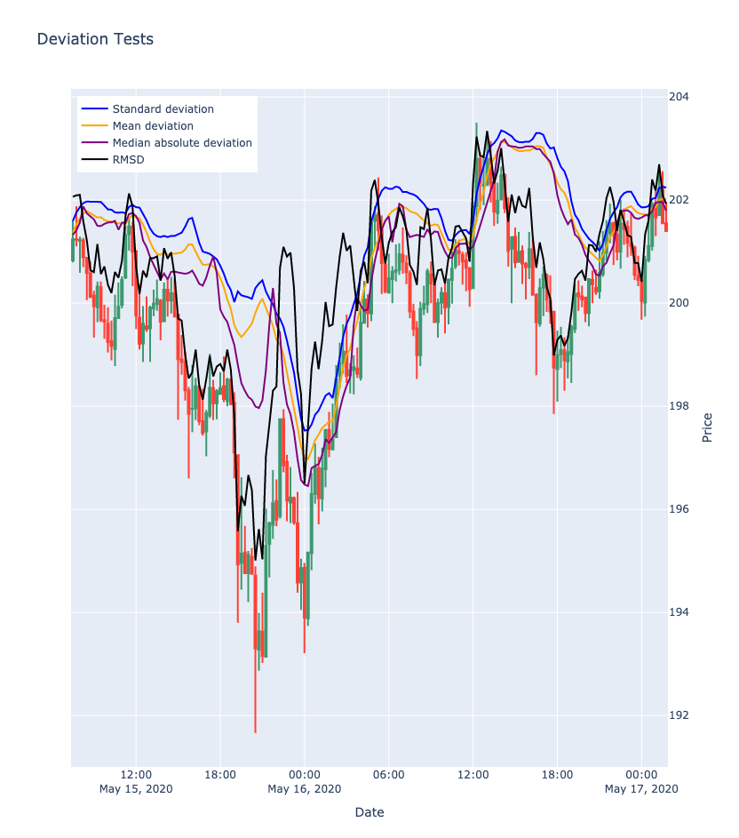
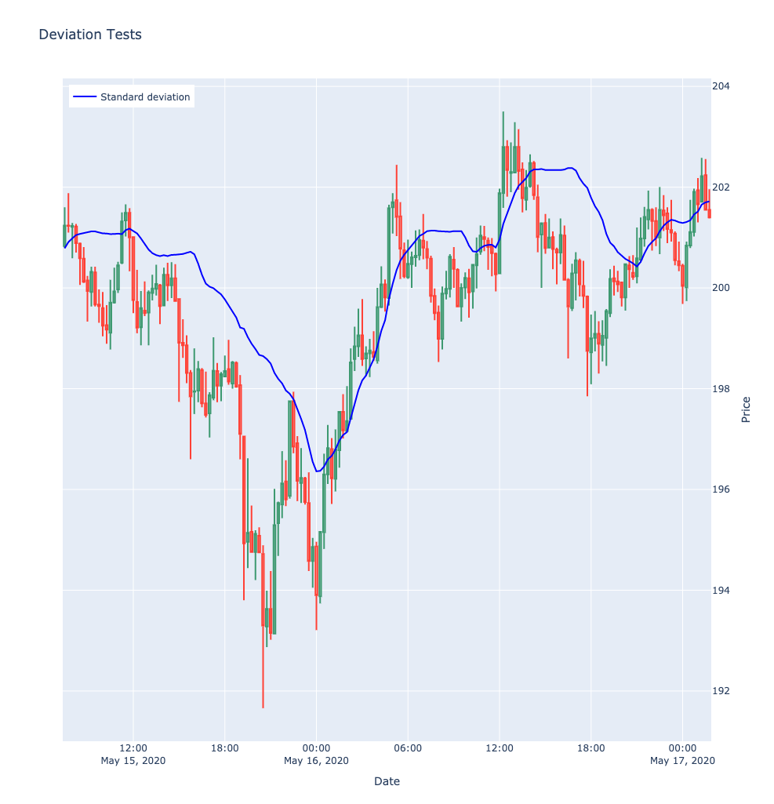
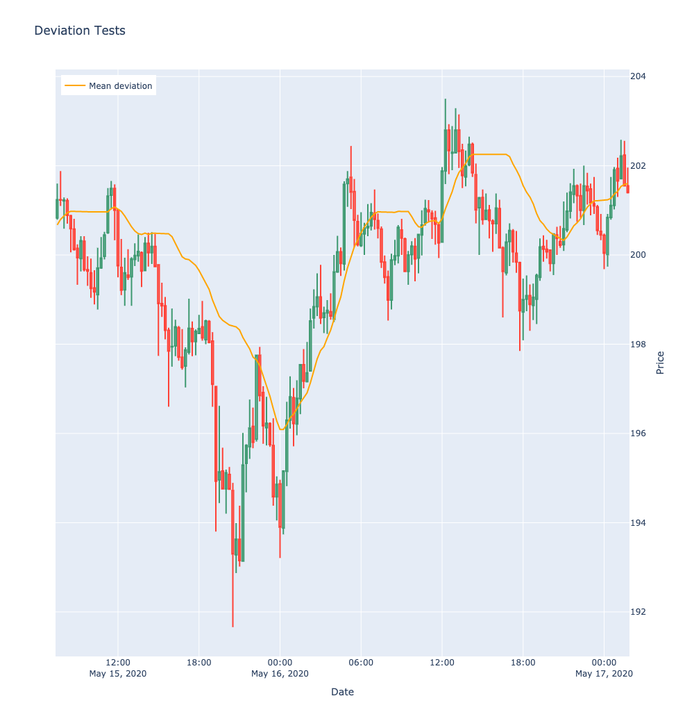
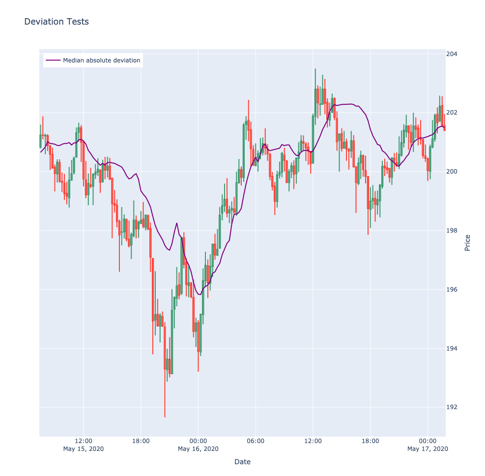
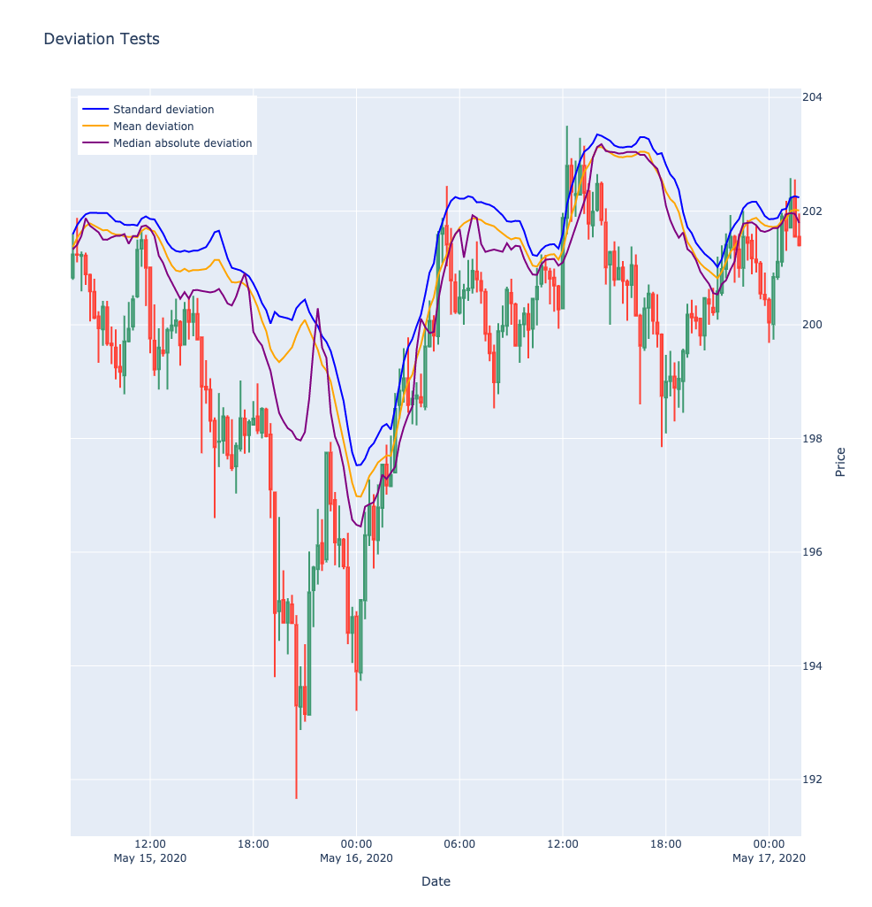
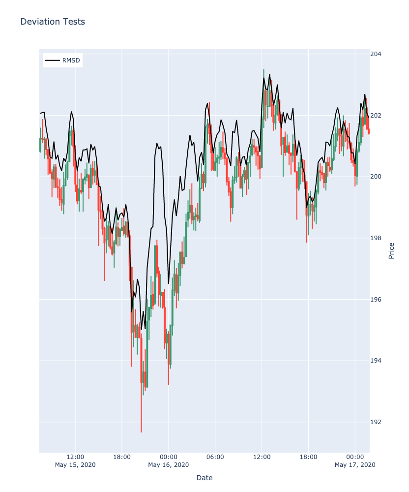
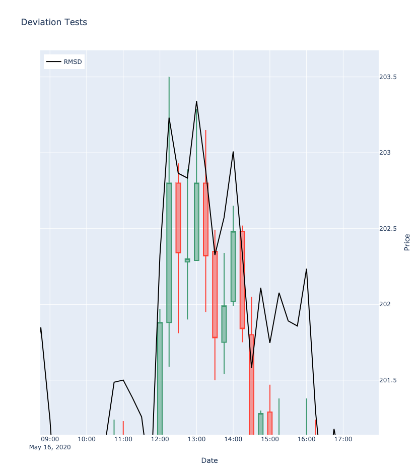

# Comparing Deviations for Profit Taking (Long)


The idea of these tests is to find the suitable deviation from a 'theoretical' current open position that will
yield the best 'sell signal'. We will test this with multiple different deviation calculations exploring the best
results we can get using a combination of mean and medians. The class is built so more tests can be easily added
as we find new maths and ideas that might work.

This is designed for the 15min timeframes of smallcap altcoins. Similar to the upper band of bollingers model, we
will use an envelope to show the orthogonal distance from the current 20sma.

For now, this is only to illustrate the rolling distances each of our deviations have on the price action and
where our sell signal might be. The actual model will use the POC and predetermined trigger that will set off
a buy signal.
Once a green candle close is above the band, it shows where the current sell signal might be for that particular
band. which we will test exstensively in our final bot backtesting

If the current price closes on or above the deviation band, it will trigger a sell (profit taking) signal.
Since we don't have our buy signal in place yet we can't measure the % gains or losses yet. That will be in the next model.


Lastly, the removal of outliers is also an important step when working with small time frames such as the 15min. Price
manipulation is common in smallcap alt coins, and can throw the mean of our calculations far from the true average. 
So being the case, we will use a method to remove them; Finding the interquartile range and operating from Q3-Q1 as
described below.

The full code can be [found here](https://github.com/369geofreeman/Cleopatra/blob/main/strategies/Deviations/main.py)

The calculations used will be:

* [Interquartile Range](#interquartile-range)
* [Standard Deviation](#standard-deviation)
* [Mean Deviation](#mean-deviation)
* [Median Absolute Deviation](#mean-absolute-deviation)
* [Z-score](#z-score)
* [RMSD](#rmsd)

The data used in these tests will be Etherium 15min candle data (May 15 2020 - 28 June 2021) [It can be found in raw form here](https://github.com/369geofreeman/Cleopatra/tree/main/strategies/Deviations/data/ETH_15min_(may_15_2020_28_June_2021).csv) I have used just a snipit of the data in some of the graphs below to show a close up of their distances.

**Below is a visual of all 3 together on 15min ETH candles (May 15th - May 17th)**




# Interquartile Range

Quartiles are the values that divide a list of numbers into quarters:

* Put the list of numbers in order
* Then cut the list into four equal parts
* The Quartiles are at the "cuts"

This removes outliers that could 'throw' our mean far from the 'true' average.

**Example**

```
Numbers = 7, 11 3, 2, 96, 14, 8

Sort the numbers: 2, 3, 7, 8, 11, 14, 96

Find the Median: 2, 3, 7, 8, 11, 14, 96
			  ^

Find the quartiles of each half (the median of each half)
		2, 3, 7, 8, 11, 14, 96
		     ^	 ^     ^
		    Q1	 Q2   Q3
		   (5)  (8) (12.5)


Use the interquartile range for calculations:
	----|5, 7, 8, 11, 12.5|---
	
	Interquartile range: Q3-Q1
```


# Standard Deviation

The Standard Deviation is a measure of how spread out numbers are.

Its symbol is σ (the greek letter sigma)

The formula is calculated as: **The square root of the Estimated Variance.**

**Calculating the Estimated Variance**
---

The Estimated Variance is defined as:

The average of the squared differences from the Mean.

To calculate the estemated variance follow these steps:

* Work out the Mean (the simple average of the numbers)
* Then for each number: subtract the Mean and square the result (the squared difference).
* Then work out the average of those squared differences.


**Example**
---
```
Mean 	= (600 + 470 + 170 + 430 + 300) / 5
	= 1970 / 5
	= 394

Variance (each number minus the mean, squared)

 	σ = (206² + 76² + (-224)² + 36² + (-95)²) / (5-1)
	σ = (42436 + 5776 + 50176 + 1296 + 8836) / 4
	σ = 21704

Standard Deviation
	σ = √21704
	  = 147.32
```




# Mean Deviation

**How far, on average, all values are from the middle.**

Find the mean of all values ... use it to work out distances ... then find the mean of those distances!

In three steps:

* Find the mean of all values
* Find the distance of each value from that mean (subtract the mean from each value, ignore minus signs)
* Then find the mean of those distances

**Example**

```
Example: the Mean Deviation of 3, 6, 6, 7, 8, 11, 15, 16

Find the mean:

Mean 	= (3 + 6 + 6 + 7 + 8 + 11 + 15 + 16) / 8
   	= 72 / 8
   	= 9

Find the distance of each value from that mean:
__________________________
|Value	| Distance from 9 |
--------------------------|
|  3	|	6	  |
|  6	|	3	  |
|  6	|	3	  |
|  7	|	2	  |
|  8	|	1	  |
|  11	|	2	  |
|  15	|	6	  |
|  16	|	7	  |
|-------------------------|

Find the mean of those distances:

Mean Deviation 	= (6 + 3 + 3 + 2 + 1 + 2 + 6 + 7) / 8
   		= 30 / 8
   		= 3.75


So, the mean = 9, and the mean deviation = 3.75
```




# Median Absolute Deviation

Median absolute deviation (MAD) is defined as the median of the absolute deviations from the data's median
It's a simple calculation to make

**Example**

```
Consider the data 
	(1, 1, 2, 2, 4, 6, 9).
		  ^

It has a median value of 2.

The absolute deviations about 2 are:
	(1, 1, 0, 0, 2, 4, 7)

which in turn have a median value of 1 (because the sorted absolute deviations are (0, 0, 1, 1, 2, 4, 7)).
											     ^
So the median absolute deviation for this data is 1.
```





## Z-score

We can additionally add a z-score to the results to increase (or lower) the take profit range.
This is a variable (integer) that can be experimented with in backtests. Is the calculation * z-score.

Below is a comparison of the same data, one with a z-score of 0 and the other, a z-score of 2





# RMSD

Standard deviation of residuals or, Root-Mean Square Error is the process of finding the line of best fit
from data points, calculating their residual, and finding the standard deviation this. 




A close up of the touch points

